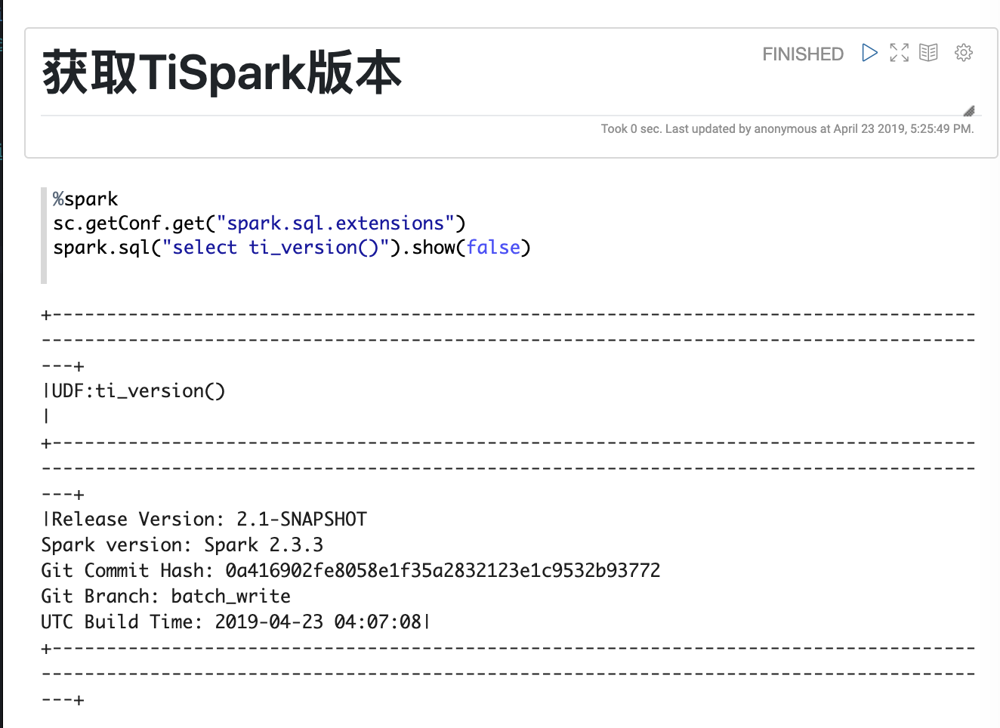
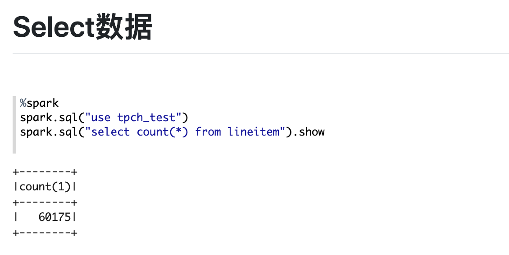
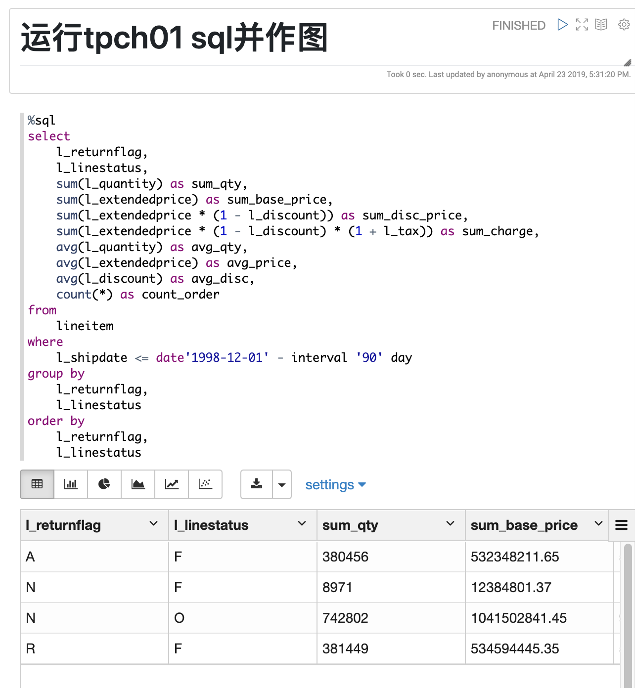
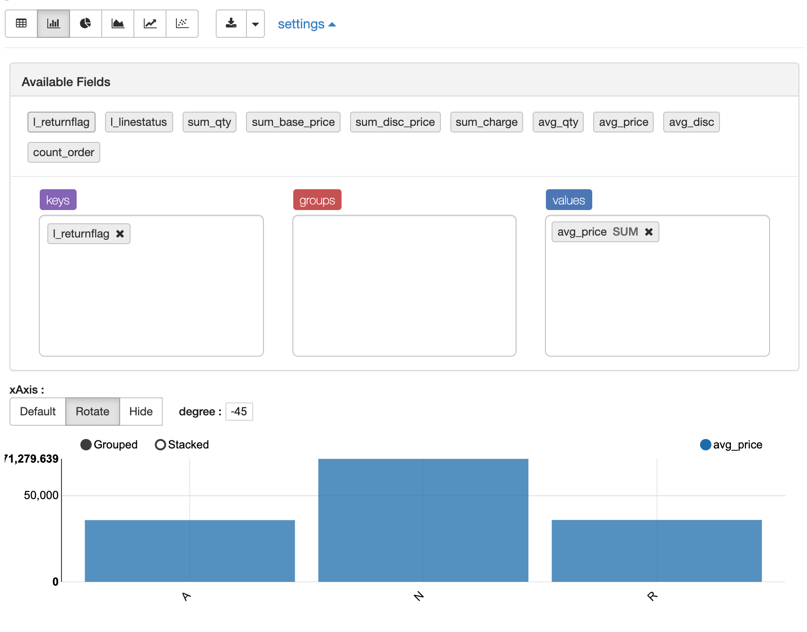

TiDB: 是一款定位于在线事务处理/在线分析处理（ HTAP: Hybrid Transactional/Analytical Processing）的融合型数据库产品，实现了一键水平伸缩，强一致性的多副本数据安全，分布式事务，实时 OLAP 等重要特性。同时兼容 MySQL 协议和生态，迁移便捷，运维成本极低。

TiSpark: 是Spark上访问TiDB的插件，可以进行复杂的OLAP查询，TiSpark支持将Spark算子下推到TiKV，极大加速了计算速度。

Apache Zeppelin: 是一个让交互式数据分析变得可行的基于网页的notebook，Zeppelin提供了数据可视化的框架。

本文主要介绍一下如何使用TiSpark和Zeppelin进行数据可视化分析。

# Step0: 部署TiSpark和Zeppelin
本地测试可以使用Docker一键部署，详见[TiSpark with Zeppelin Docker Compose](https://github.com/marsishandsome/tispark-with-zeppelin-docker-compose)。

```
git clone https://github.com/marsishandsome/tispark-with-zeppelin-docker-compose
cd tispark-with-zeppelin-docker-compose
./build.sh
./start.sh
```

# Step1: 导入tpch测试数据
打开zeppelin web界面`http://127.0.0.1`，新建一个Notebook，并运行下面的命令将tpch测试数据导入到TiDB (%sh 表示执行引擎是/bin/sh)
```
%sh
bash /opt/tispark-tests/loaddata.sh
```


# Step2: 获取TiSpark版本
运行下面的语句获取TiSpark版本 (%spark表示执行引擎是spark)
```
%spark
sc.getConf.get("spark.sql.extensions")
spark.sql("select ti_version()").show(false)
```



# Step3: Select数据
运行下面的语句进行简单的select语句
```
%spark
spark.sql("use tpch_test")
spark.sql("select count(*) from lineitem").show
```



# Step4: 运行tpch01 sql并作图
运行下面的语句进行tpch01 query执行 (%sql表示执行引擎是spark sql)
```
%sql
select
    l_returnflag,
    l_linestatus,
    sum(l_quantity) as sum_qty,
    sum(l_extendedprice) as sum_base_price,
    sum(l_extendedprice * (1 - l_discount)) as sum_disc_price,
    sum(l_extendedprice * (1 - l_discount) * (1 + l_tax)) as sum_charge,
    avg(l_quantity) as avg_qty,
    avg(l_extendedprice) as avg_price,
    avg(l_discount) as avg_disc,
    count(*) as count_order
from
    lineitem
where
    l_shipdate <= date'1998-12-01' - interval '90' day
group by
    l_returnflag,
    l_linestatus
order by
    l_returnflag,
    l_linestatus
```


可以基于返回的数据，在zeppelin界面上进行进一步作图

