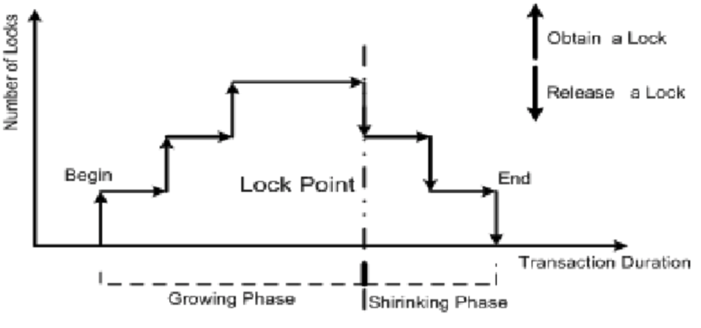
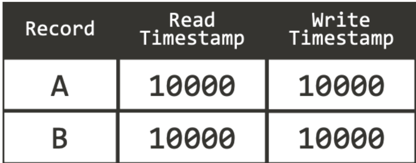

MVCC是目前大部分主流数据库实现并发控制的方法，本篇主要介绍一下数据库解决并发控制问题的发展历史，从最开始的`Two Phase Locking (2PL)`到`Basic Timestamp Ordering (Basic T/O)`，再到`Optimistic Concurrency Control(OCC)`。引入了`Multi Version`的概念后，又在原来的基础上产生了`Multi Version Two-phase Locking (MV2PL)`、`Multi Version Timestamp Ordering (MVTO)`和`Multi Version Optimistic Concurrency Control (MVOCC)`。

本篇涉及的都是单机版的数据库实现，后续会再讨论如果将MVCC和分布式数据库结合。

# 事务冲突类型
两个事务并发，什么情况下会冲突?

需要满足以下条件:
- 操作同一对象：两个事务都尝试修改A账户的余额，这就有冲突，如果修改的是不同的账户，就没有冲突
- 发生在不同事务：单个事务内无论对A账户的余额做了多少次修改，都不会产生冲突
- 读写/写读/写写：无论多少个事务，如果对A账户的余额只有读操作，那就永远没有冲突

先规定下记号
- Xstart：表示X事务开始
- Xwrite：表示X事务写入
- Xread：表示X事务读取
- Xabort：表示事务回滚
- Xcommit：表示事务提交

## 读写冲突(read too late)
- T1: `T1start => T1read`
- T2: `T2start => T2write`

事务T1先于事务T2，T1应该读取T2写入前的值，但是如果是下面的执行顺序

`T1start=> T2start => T2write => T1read`

T1先于事务T2发生，但这时候发生了线程切换，事务T2先将数据写入了那个对象，切回T1的时候，结果只能读到T2刚写入的值了。如果我们遵循物理世界规律的话，T1相当于未卜先知了，显然不合逻辑。

## 写读冲突(write too late)
- T1: `T1start => T1write`
- T2: `T2start => T2read`

事务T1先于事务T2，T2应该读取T1写入的值，但是如果是下面的执行顺序

`T1start => T2start => T2read => T1write`

事务T1先于事务T2发生，T2事务在读取那个对象的时候，T1事务已经开始了但还没来得及写入数据。在外部看来，T2属于明知故犯，T1的新写入值应该已经被获知了，但仍然返回旧的值。

## 写写覆盖
- T1: `T1start => T1write`
- T2: `T2start => T2write`

事务T1先于事务T2，T1应该先写入，然后再被T2的写入覆盖，但是如果是下面的执行顺序

`T1start => T2start => T2write => T1write`

T1这个事务发生在T2之前，但T1的写入发生在T2之后。这会导致覆盖问题，应该是T2的数据覆盖T1的数据，但实际是T1的数据覆盖T2的数据。

## 写写abort
- T1: `T1start => T1write => T1commit`
- T2: `T2start => T2write => T2abort`

T1成功写入，T2回滚应该不影响T1写入的数据，但是如果是下面的执行顺序

`T1start => T2start => T2write => T1write => T1commit => T2abort`

T2 abort后恢复的值从逻辑上说应该是T1的，但T1write发生在T2write之后，就没办法修复正确的值了。根本上，我们"误信"了还没有commit的事务的鬼话。

## 脏读
- T1: `T1start => T1write => T1abort`
- T2: `T2start => T2read`

T1 abort，T2应该读取旧的数据，但是如果是下面的执行顺序

`T1start => T1write => T2start => T2read => T1abort`

T2事务读到了T1的值，但T1之后abort了，T2的值就是错误的了。

# 并发控制 Concurrency Control
Concurrency Control就是为了来解决并发事务之间的冲突。

> A DBMS’ concurrency control protocol to allow transactions to access a database in a multi-programmed fashion while preserving the illusion that each of them is executing alone on a dedicated system. The goal is to have the effect of a group of transactions on the database’s state is equivalent to any serial execution of all transactions.

DBMS并发控制协议可以使得不同的事务可以并发的访问DBMS，同时让不同的事务感觉仿佛只有自己一个事务在运行。也就是说并发控制需要达到这样的目标：不同事务并发的执行结果，和这些事务串行的执行的结果是等价的。

实现并发控制有两种办法：
> 1. Two-Phase Locking (Pessimistic): Assume transactions will conflict so they must acquire locks on database objects before they are allowed to access them.
> 2. Timestamp Ordering (Optimistic): Assume that conflicts are rare so transactions do not need to first acquire locks on database objects and instead check for conflicts at commit time.

Two-Phase Locking是一种悲观锁模式，假设事务冲突比较严重，因此在访问数据前需要先获得锁。

Timestamp Ordering是一种乐观锁模式，假设事务冲突比较少，因此在访问数据前不需要获得锁，而是在commit的时候检查冲突。

## Two-Phase Locking (2PL)
2PL是指事务的执行可以分为两个阶段：生长阶段Growing Phase（加锁阶段）和衰退阶段Shrinking Phase（解锁阶段）：
- 加锁阶段：在该阶段可以进行加锁操作。在对任何数据进行读操作之前要申请并获得读锁，在进行写操作之前要申请并获得写锁。加锁不成功，则事务进入等待状态，直到加锁成功才继续执行。
- 解锁阶段：当事务释放了一个封锁以后，事务进入解锁阶段，在该阶段只能进行解锁操作不能再进行加锁操作。

2PL可以这样来实现：事务开始后就处于加锁阶段，一直到执行ROLLBACK和COMMIT之前都是加锁阶段。ROLLBACK和COMMIT使事务进入解锁阶段，即在ROLLBACK和COMMIT模块中DBMS释放所有封锁。

可以证明，若并发执行的所有事务均遵守两段锁协议，则对这些事务的任何并发调度策略都是可串行化的。

需要注意的是2PL可能会有死锁问题，需要有死锁检测和防范机制。

因为2PL对所有读写的数据都进行了加锁，因此不同事物之间的读写冲突都可以避免，也正是由于对所有读写的数据都进行了加锁，并发访问冲突比较多的时候，由于锁竞争，会导致事物执行效率大大降低。

## Basic Timestamp Ordering Protocol
Basic T/O使用Timestamp来决定事务的先后顺序。

> Basic T/O Protocol
- Every transaction is assigned a unique timestamp when they arrive in the system.
- The DBMS maintains separate timestamps in each tuple’s header of the last transaction that read that tuple or wrote to it.
- Each transaction check for conflicts on each read/write by comparing their timestamp with the timestamp of the tuple they are accessing.
- The DBMS needs copy a tuple into the transaction’s private workspace when reading a tuple to ensure repeatable reads

Basic T/O协议主要特点：
- 每个事务都会被赋予一个Timestamp
- 每条数据都会记录最近读取该数据的事务id，以及最近写入的事务id
- 每个事务在读写数据时需要根据事务的timestamp和数据的读写timestamp进行冲突检测
- DBMS会把事务读取过的数据拷贝到一个private的空间，来实现可重复读

Basic T/O需要对每条记录额外存储以下几个信息：
1. Read Timestamp: 表示读过该数据中最大的事务Timestamp
2. Write Timestamp: 最近更新该数据的事务Timestamp

read流程：
1. 事务T尝试读取`tuple A`
2. 检查是否满足`事务timestamp >= Write Timestamp`，不满足则返回错误
3. 满足则修改`Read Timestamp = Max(Read Timestamp, 事务timestamp)`
4. 返回成功

write流程：
1. 事务T尝试更新`tuple B`
2. 检查是否满足`事务timestamp > Write Timestamp` 并且 `事务timestamp > Read Timestamp`，如果不满足则返回错误
3. 如果满足则更新数据同时修改`Write Timestamp = 事务timestamp`
4. 返回成功

Basic T/O如何解决读写冲突：
- 读写：T1表示读，T2表示写，`T1 timestamp < T2 timestamp`，但是T2先写成功，这时`Write Timestamp = T2 timestamp`，T1再去读的是否发现`T1 timestamp < Write Timestamp`，返回错误，即写成功读失败
- 写读： T1表示写，T2表示读，`T1 timestamp < T2 timestamp`，但是T2先读成功，这时`Read Timestamp = T2 timestamp`，T1再去写的时候发现`T1 timestamp < Read Timestamp`，返回错误，即读成功写失败
- 写写覆盖：T1 T2都是写，`T1 timestamp < T2 timestamp`，但是T2先写成功，这是`Write Timestamp = T2 timestamp`，T1再去写的时候发现`T1 timestamp < Write Timestamp`，返回错误，即先写的成功后写的失败
- 写写abort：没法解决，导致数据错误
- 脏读：没法解决

可以发现Basic T/O可以成功解决读写、写读和写写覆盖这些并发冲突问题，但是由于commit前数据的修改是直接在DBMS记录上做的修改，因此无法解决事务回滚导致的冲突，例如写写abort和脏读问题。

## Optimistic Concurrency Control (OCC)
OCC会把所有修改先缓存到本地private空间，然后在commit的时候检测冲突并merge，因此可以成功解决Basic T/O无法处理事务回滚引起冲突的问题。

> Three Phases:
- Read Phase: Transaction’s copy tuples accessed to private work space to ensure repeatable reads，and keep track of read/write sets.
- Validation Phase: When the transaction invokes COMMIT，the DBMS checks if it conflicts with other transactions. Parallel validation means that each transaction must check the read/write set of other transactions that are trying to validate at the same time. Each transaction has to acquire locks for its write set records in some global order. Original OCC uses serial validation.
  - Backward Validation: Check whether the committing transaction intersects its read/write sets with those of any transactions that have already committed.
  - Forward Validation: Check whether the committing transaction intersects its read/write sets with any active transactions that have not yet committed.
- Write Phase: The DBMS propagates the changes in the transactions write set to the database and makes them visible to other transactions’ items. As each record is updated，the transaction releases the lock acquired during the Validation Phase

OCC事务提交分三个阶段：
- 读取阶段：所有读取的数据会拷贝到本地空间，所有写也只记录到本地空间
- 验证阶段：事务执行commit的时候，DBMS会先检查该事务是否和其他事务有冲突，验证阶段需要对事务修改的数据进行加锁
- 写阶段：把本地空间的修改apply到DBMS，让其他事务可见，最后释放验证阶段加的锁

OCC需要对每条记录额外存储以下几个信息：
1. Write Timestamp: 最近更新该数据的事务的Timestamp

read流程：
1. 事务T尝试读取`tuple A`
2. 如果本地空间没有，则从DBMS中查询`tuple A`，并拷贝到本地空间
3. 成功返回

write流程：
1. 事务T尝试更新`tuple B`
2. 如果本地空间没有，则从DBMS中查询`tuple B`，并拷贝到本地空间
3. 在本地空间更新数据，并返回成功

commit流程：
1. 生成`事务timestamp`
2. 验证阶段：通过Backward validation或者Forward validation检测是否有冲突，如果有冲突直接回滚，同时还需要对需要修改的数据进行加锁
3. 写阶段: 把本地空间的修改apply到DBMS，其中`Write Timestamp = 事务timestamp`
4. 最后释放锁

回滚流程：
1. 在提交前没有对DBMS数据做任何修改，回滚只需要清空本地空间的数据

OCC如何解决读写冲突：
- 读写：T1事物Timestamp < T2事物Timestamp，但是T1和T2的验证阶段和写阶段可能会以任意的顺序执行，可以保证的是T2进行验证阶段的时候，T1已经进入完成write流程，所以T2验证阶段会发现需要修改的数据被小于本事务时间戳的事务T1读取了，T2会直接回滚，即读成功写失败
- 写读： 原来同上，写成功读失败
- 写写覆盖：原理同上，第一个写成功第二个写失败
- 写写abort：事务T2 abort后不会对数据有任何修改，所以不会影响事务T1的提交
- 脏读：事务T2读到是原始的数据，而不是T1修改过的数据，因此T1 abort不会影响T2的提交

OCC成功解决了所有读写冲突的问题，但是每次读取数据都需要把数据拷贝到private空间，导致读取效率比较低。

## Validation
当事务commit的时候，DBMS会该事务和其他事务是否冲突，有两种检测方法：
1. Backward Validation
2. Forward Validation

Backword Validation会检查当前事务读写的数据集是否和已提交的事务冲突。

> Check whether the committing txn intersects its read/write sets with those of any txns that have already committed.

# MVCC
MVCC使用`Multi Version`的方法，即对一个`logical tuple`存储多个版本的`physical tuple`，可以解决OCC读取时需要把数据拷贝到private空间的问题。

> MVCC is currently the best approach for supporting transactions in mixed workloads. The DBMS maintains multiple physical versions of an object of a single logical object in the database. When a transaction writes to an object, the DBMS, creates a new version of that object. When a transaction reads an object, it reads the newest version that existed when a transaction started.

MVCC目前已经被广泛使用到DBMS中，DBMS保持一个逻辑数据的多个物理版本，当事务写入时创建一个新的物理版本，当事务读取时，返回最新的物理版本。

MVCC主要的优点：
- Writes do not block readers （写不会阻塞读）
- Read-only transactions can read a consistent snapshot without acquiring locks （只读的事务不需要加锁，就可以获得一致性的快照）
- Easily support time-travel queries （天然支持time-travel)

MVCC不仅仅是一个并发控制协议，MVCC完全影响了DBMS处理事务的设计，MVCC几个关键问题包括：
1. Concurrency Control Protocol
2. Version Storage
3. Garbage Collection
4. Index Management
5. Transaction Id Wraparound

其实`Multi Version`不仅仅可以和OCC结合，也可以和2PC、Basic T/O结合，因此产生了：
1. Multi Version Timestamp Ordering (MVTO)
2. Multi Version Optimistic Concurrency Control (MVOCC)
3. Multi Version Two-phase Locking (MV2PL)

## Multi Version Timestamp Ordering (MVTO)
MVTO是在Basic T/O的基础上加上Mulit Version的功能。

MVTO需要对每条记录额外存储以下几个信息：
1. txn-id: 0表示没有被锁，非0表示该锁被ID=txn-id的事务锁持有
2. read-ts: 读取该条记录的事务中txn-id的最大值
3. begin-ts：写入该条记录的事务txn-id
4. end-ts：如果该条记录是最新的，则end-ts=INF；否则ent-ts=下一个版本的begin-ts

MVTO的特点：
- Use the transactions’ identifiers (Tid) to precompute their serialization order (使用事务ID预先计算串行顺序)
- Use a read-ts field in the header to keep track of the timestamp of the last transaction that read it （使用read-ts记录最近读取该条数据的事务）
- Transaction is allowed to read version if the lock is unset and its Tid is between begin-ts and end-ts （事务允许读的条件：记录没有被加锁  && 事务id介于begin-ts和end-ts之间）
- For writes, transaction creates a new version if no other transaction holds lock and Tid is greater than read-ts （事务允许写的条件：记录没有被加锁 && 事务id大于read-ts）

事务start流程：
1. 生成事务timestamp赋给`Tid`

read流程：
1. 事务T尝试读取`logical tuple A`
2. DBMS找到一个`physical version`，满足`begin-ts <= Tid < end-ts`
3. 如果该`physical version`的写锁没如果被其他事务持有，则返回失败
4. 更新该`physicl version`的`read-ts`为`Max(Tid, read_ts)`
5. 返回成功

write流程：
1. 事务T尝试更新`logical tuple B`
2. 找到B的最新的`physical version`，即`Bx`
3. 如果`Bx`的写锁没有被持有，并且`Tid > Bx的read-ts`，则可以写入，否则写入失败
4. 对`Bx`进行加锁
5. 创建一个新的版本`Bx+1`，并加锁即设置`txn-id = Tid`
6. 加入到Write Set

commit流程
1. 对Write Set中的记录执行下面的操作
2. 设置`Bx+1的begin-ts = Tid`，`Bx+1的end-ts = INF`，`Bx的end-ts = Tid`
3. 释放锁

MVTO如何解决读写冲突：
- 读写：T1表示读，T2表示写，`T1 timestamp < T2 timestamp`，但是T2先写成功，这是T1再去读的时候不会读到T2刚写的数据，因为`T1 timestamp < T2 timestamp`，T1会成功读取正确版本的数据，即读写都成功
- 写读：T1表示写，T2表示读，`T1 timestamp < T2 timestamp`，但是T2先读成功，这时`Read Timestamp = T2 timestamp`，T1再去写的时候发现`T1 timestamp < Read Timestamp`，返回错误，写入失败，即写失败读成功
- 写写覆盖：写写通过加锁进行互斥访问，先获得锁的事务写入成功
- 写写abort：通过创建新的版本来实现写，因此一个事务写回滚，不会影响另外一个事务写
- 脏读：通过创建新的版本来实现写，因此一个事务写回滚，不会影响另外一个事务读

##  Multi Version Optimistic Concurrency Control (MVOCC)
MVOCC是在OCC的基础上加上Mulit Version的功能。

MVOCC需要对每条记录额外存储以下几个信息：
1. txn-id: 0表示当前没有加锁，非0表示当前被txn-id这个事务加了锁
2. begin-ts：写入该条记录的事务的commit timestamp
3. end-ts：如果该条记录是最新的，则end-ts=INF；否则ent-ts=下一个版本的begin-ts

MVOCC事务提交分三个阶段：
- read phase：
  - 读：根据数据的`begin-ts`和`end-ts`，返回该数据最新的已commit的版本
  - 写：获取写锁，创建新版本
- validation phase：
  - 获取`事务commit timestamp`，决定了事务的serialization order
  - 检查read set中的数据是否被已commit的事务所修改，如果冲突则回滚
- write phase：把所有修改的数据的`begin-ts`设置为`事务commit timestamp`，`end-ts`设置为`INF`

一个事务修改的数据只有commit后，才能被另外一个事务看到。如果一个事务读取了过时的数据，在该事务提交后执行验证阶段会检测出来，如果冲突则回滚。

事务start流程：
1. 获取事务ID`txn-id`

read流程：
1. 事务T尝试读取tuple A
2. 根据数据的`begin-ts`和`end-ts`，返回该数据最新的已commit的版本
3. 把该条数据加入事务read set

write流程：
1. 事务T尝试更新tuple B
2. 对tuple B进行加锁，如果失败则回滚
3. 加锁成功，创建一个新的版本`Bx+1`，其中`txn-id=事务ID`
4. 把该条数据加入事务write set

commit流程：
1. 生成`事务commit timestamp`
2. 检测read set中的数据是否被已commit的事务所修改，有的话直接回滚
3. 把write set中的数据的`begin-ts`设置为`事务commit timestamp`，`end-ts`设置为`INF`，上一个版本数据的`end-ts`设置为`事务commit timestamp`
4. 解锁

abort流程：
1. 删除write set中所有最新的本事务创建的记录
2. 解锁

MVOCC如何解决读写冲突：
- 读写：T1表示读，T2表示写，虽然T1先开始，但是T2写实际执行先与T1读，由于T1只会读取已commit的数据，因此不会受到T2写的影响，即读写都成功
- 写读： T1表示写，T2表示读，T2读到的是老数据，但是在T2 validation阶段会检查到T2 read set中的数据被T1修改过，导致T2回滚，即写成功读失败
- 写写覆盖：写写通过加锁进行互斥访问，先获得锁的事务写入成功
- 写写abort：通过创建新的版本来实现写，因此一个事务写回滚，不会影响另外一个事务写
- 脏读：只会读取commit的数据，因此不会出现脏读

## Multi Version Two-phase Locking (MV2PL)
MVOCC是在2PC的基础上加上Mulit Version的功能。

MV2PL需要对每条记录额外存储以下几个信息：
1. txn-id: 当前对该记录加写锁的txn-id，0表示没有写锁
2. read-cnt: 表示读锁的数量，0表示没有读锁
3. begin-ts:写入该条记录的事务txn-id
4. end-ts：如果该条记录是最新的，则end-ts=INF；否则ent-ts=下一个版本的begin-ts

事务start流程：
1. 生成事务ID`Tid`

read流程：
1. 事务T尝试读取`logical tuple A`
2. DBMS找到一个`physical version`，满足`begin-ts <= Tid < end-ts`
3. 检查是否有写锁，如果有的话直接 错误
4. 如果没有写锁，对`read-cnt`进行`+1`，然后成功返回该条记录的值
5. 加入到read set

write流程：
1. 事务T尝试更新`logical tuple B`
2. 找到B的最新的`physical version`，即`Bx`
3. 如果`Bx`的写锁没有被持有，并且读锁也没有被持有，即`read-cnt == 0`，则可以写入，否则写入失败
4. 对`Bx`进行加锁，即设置`txn-id = Tid`
5. 创建一个新的版本`Bx+1`，设置`txn-id = Tid`
6. 加入到write set

commit流程：
1. 申请一个`Tcommit`
2. 对所有write set中的数据，进行下面的操作
3. 设置`Bx+1的begin-ts = Tcommit`，`Bx+1的end-ts = INF`，`Bx的end-ts = Tcommit`
4. 释放write set中的写锁
5. 释放read set中的读锁，即对`read-cnt`进行`-1`操作

abort流程：
1. 删除write set中新增的版本记录
2. 释放写锁
3. 释放读锁

MVTO如何解决读写冲突：
- 读写：读写谁先加到锁，谁成功
- 写读：读写谁先加到锁，谁成功
- 写写覆盖：写锁互斥方式
- 写写abort：写锁互斥方式
- 脏读：读取的都是commit的数据，不会发生脏读

# 常见DBMS使用的并发控制协议

# 参考
- [CMU 15-721 DBMS课程](https://15721.courses.cs.cmu.edu/spring2018/schedule.html)
- [An Empirical Evaluation of In-Memory Multi-Version Concurrency Control](https://15721.courses.cs.cmu.edu/spring2018/papers/05-mvcc1/wu-vldb2017.pdf)
- [Basic T/O，MV-TO以及"真"MVCC -- 吉姆餐厅](https://zhuanlan.zhihu.com/p/30635236)
- [数据库中的two phase locking](https://www.cnblogs.com/lyhabc/p/4753540.html)
