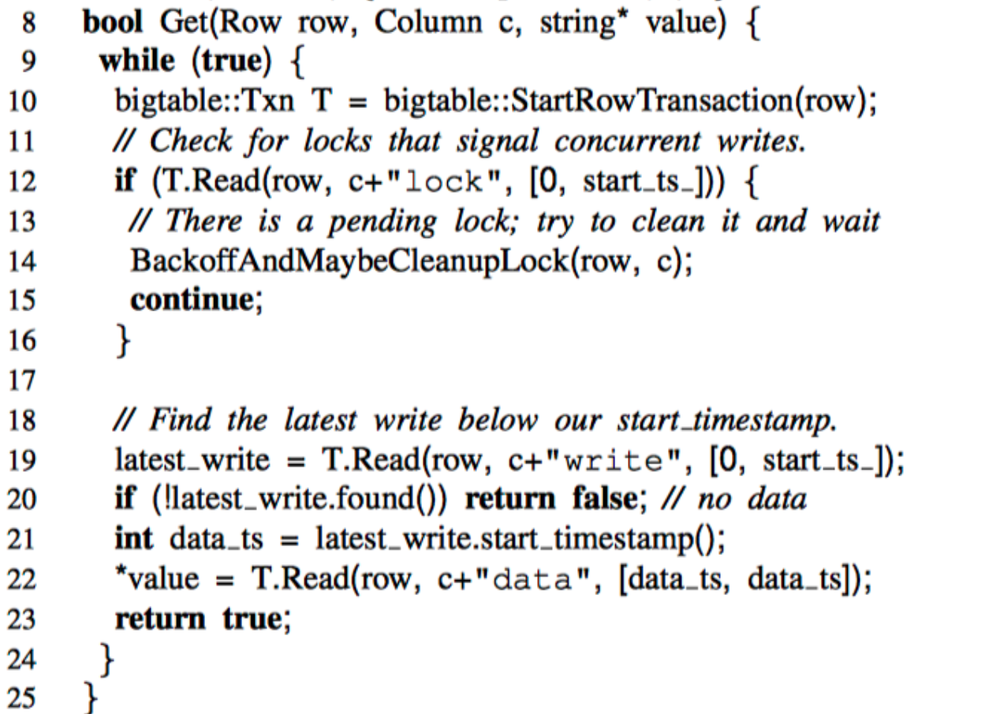

本文将介绍一下谷歌在2010发表的论文《Large-scale Incremental Processing Using Distributed Transactions and Notifications》。

# Percolator 简介
Percolator是由Google公司开发的、为大数据集群进行增量处理更新的系统，主要用于google网页搜索索引服务。使用基于Percolator的增量处理系统代替原有的批处理索引系统后，Google在处理同样数据量的文档时，将文档的平均搜索延时降低了50%。

Percolator是在Bigtable之上实现的，是为Bigtable定制的，它以Client library的方式实现。Percolator利用Bigtable的单行事务能力，仅仅依靠客户端侧的协议和一个全局的授时服务器TSO就实现了跨机器的多行事务。

# 存储结构
用户指定的Perocolator中的Column在Bigtable中会映射到如下3个Column：
- lock: 存储锁信息
- write: 存储commit的timestame以及标记该行已经committed
- data: 存储实际数据


实际的数据由这三列共同决定，下面看一个例子：


如何查看Bob账户有多少钱？

先查询`column write`获取最新时间戳的数据，获取到`data@5`，然后查询`column data`里面时间戳为`5`的数据，即`$10`，也就是说Bob账户目前有10美元。

# 事务读写流程
一个事务的所有Write在提交之前都会先缓存在Client，然后在提交阶段一次性写入；Percolator 的事务提交是标准的两阶段提交，分为Prewrite和Commit。在每个Transaction开启时会从TSO获取timestamp作为start_ts，在Prewrite成功后Commit前从TSO获取timestamp作为 commit_ts。协议伪代码如下图：


## 数据结构
先来看一下数据结构`struct Write`包含
1. `Row row` 表示某一行
2. `Column col` 表示某一列
3. `string value` 表示实际写入的数据

另外
1. `vector<Write> writes_` 用于在内存中缓存需要写入的数据
2. `int start_ts_`表示事务开始的`timestamp`


## 初始化
初始化`Transaction`的时候获取了一下`start_ts_`


## Set
`Set`只是简单的在内存中做个缓存，实际写入会在`Commit`时触发


## Get
Get操作
1. 先看一下是否有`timestamp`小于`start_ts`的锁，如果有的话需要先`Cleanup lock`
2. 然后读取并返回`commit timestamp`小于`start_ts`的最新的数据



## Cleanup lock
Cleanup primary lock: 看该主锁是否已超时，如果超时直接把锁删除，否则不做任何操作

Cleanup secondary lock: 先看主锁的状态
1. 主锁已经commit: commit该次锁
2. 主锁未commit && 已超时: 如果次锁也超时则清理次锁，否则不做任何操作
3. 主锁未commit && 未超时: 不做任何操作

## Prewrite
prewrite阶段
1. 先看一下有没有`commit timestamp`大于`start_ts`的数据，如果已经有了说明已经有后续的事务提交了数据，这是本事务不能再往里面写了，直接return false
2. 再看一下是否已经被上锁了，如果有的话说明有写冲突，直接return false
3. 写入`data`和`lock`字段


## Commit
commit阶段
1. 先从需要写入的数据中任选一行作为`primary`，其他的作为`secondary`
2. 接着调用`prewrite primary`
3. 然后对`secondary rows`进行循环调用`prewrite secondary`
4. 获取`commit_ts`
5. 查询`primary row`上是否有锁，如果没有说明被已经超时被清理，直接退出
6. 对`primary row`写入`write`列同时清除`lock`列
7. 至此数据已写入成功
8. 对`secondary rows`循环，写入`write`列同时清除`lock`列


# 案例
下面来看一个银行转账的案例，Bob向Joe转账7美元。

## 初始状态
初始状态下Bob有10美元，Joe有2美元。


## Prewrite Primary
开始prewrte阶段，首先
1. 获取下一个时间戳`timestamp=7`作为事务的`start_ts`
2. 将Bob作为事务的`primary row`
3. `lock`列写入`Primary Lock`
4. 同时`data`列写入`3`


## Prewrite Secondary
同样使用上一步获取的`start_ts=7`
1. 将Joe的数据`9`写入到`data`列
2. 同时将`lock`列指向上一步的`Primary Lock`


## Commit Primary
开始commit阶段，
1. 获取`commit_ts=8`
2. 删除primary所在的`lock`列的锁
3. 并将`write`列写入提交时间戳指向的数据存储`data@7`


## Commit Secondary
依次遍历`secondary rows`
1. `write`column中写入数据时间戳
2. 同时删除`lock`列的锁


# 总结
Percolator基于Bigtable的单行事务提供了多行事务的能力，核心思想包括：
1. 将事务提交是否成功落实到一个原子操作，即`primary row`是否`commit`成功
2. 写入失败遗漏的锁，通过后续读阶段进行超时清理
3. 通过全局唯一递增的时间戳，判断写冲突，并提供Snapshot Isolation级别的隔离

# 参考
- [Large-scale Incremental Processing Using Distributed Transactions and Notifications](https://storage.googleapis.com/pub-tools-public-publication-data/pdf/36726.pdf)
- [Percolator 和 TiDB 事务算法](https://pingcap.com/blog-cn/percolator-and-txn/)
- [Google Percolator 的事务模型](http://andremouche.github.io/transaction/percolator.html)
- [Transaction in TiDB](http://andremouche.github.io/tidb/transaction_in_tidb.html)
- [Google Percolator 分布式事务实现原理解读](http://mysql.taobao.org/monthly/2018/11/02/)

==== 20190617更新 ====
# 如何解决写写冲突？
如果在prewrite的时候发现有lock，并且尝试resolve lock失败，说明有写写冲突，可以直接return false，让客户端进行重试。

# 如何解决读写冲突？
举个读写冲突的例子：
- 事务a：写操作 `start_ts = 10`
- 事务b：读操作 `start_ts = 50`

当前`timestamp = 60`，此时事务a还没commit，这时事务b去读取数据时发现了事务a留下的lock，
事务b需要读取`commit_ts <= 50`的数据，但是事务a在`timestamp=60`的时候还没发送commit操作，
照理说事务b不需要管事务a留下的lock，但是存在这么一种情况需要让事务b去等待事务a的锁：

1. 事务a获取 `start_ts=10`
2. 事务a `prewrite`
3. 事务a获取 `commit_ts=40`
4. 事务b获取 `start_ts=50`
5. 事务b `读取数据`
6. 事务a `commit`

如果事务b不去等事务a的lock，事务b会溜掉`commit_ts=40`的数据。

主要的原因是在分布式环境下获取`commit_ts`和执行`commit`操作是两个操作，中间可能会因为机器、网络等原因导致一定时间的间隔。

# TiDB解决大事务读写冲突的办法
在大事务的场景下，读写冲突会非常严重，想象一下一个大事务需要写大量数据，持续几十分钟到几个小时，在这段时间内所有读取写冲突的数据都会返回失败，对于OLTP场景根本无法接受，但其实读取的数据是已经存在在数据库，导致冲突只是为了避免写的`commit_ts`小于当前读的`timestamp`的情况。

解决这个问题需要引入一个新的事务类型LargeTxn。

在LargeTxn 的事务类型下，读事务不再只是被动的等待事务的提交结果，而是去主动的影响事务的提交过程，在查看事务状态的同时更新事务的状态，把不确定的状态变成确定的状态，从而避免无谓的等待。

- LargeTxn的primary lock里记录一个MinCommitTS值，初始值为`startTS + 1`
- LargeTxn在commit primary lock的时候，需要保证`CommitTS >= MinCommitTS`
- 读事务如果读到了LargeTxn Lock，会立刻在primary lock所在的region上执行 ResolveLargeTxnLockForRead，把MinCommitTS设置为自己的readTS

ResolveLargeTxnLockForRead的伪代码如下：

```
lock := loadLock(key)
if lock != nil {
	if isExpired(lock.StartTS, lock.TTL) {
		db.Rollback(key)
	} else if readTS >= lock.MinCommitTS {
		lock.MinCommitTS = readTS + 1
		db.Put(lock)
	}
	return readOld
} else {
	if db.isCommited(largeTxnTS) {
		return readNew
	}
	// txn is rollbacked.
	return readOld
}
```
