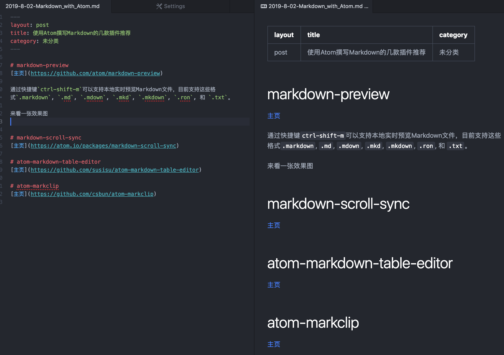

# markdown-preview
[markdown-preview主页](https://github.com/atom/markdown-preview)

安装markdown-preview插件后，通过快捷键`ctrl-shift-m`可以支持本地实时预览Markdown文件，目前支持这些格式`.markdown`, `.md`, `.mdown`, `.mkd`, `.mkdown`, `.ron`, 和 `.txt`。

来看一张效果图



# markdown-scroll-sync
[markdown-scroll-sync主页](https://atom.io/packages/markdown-scroll-sync)

安装markdown-scroll-sync插件后，在使用markdown-preview进行预览的时候，左测markdown编辑框和右侧的html预览框可以进行同步的滚动。

来看一下效果图


# atom-markdown-table-editor
[atom-markdown-table-editor主页](https://github.com/susisu/atom-markdown-table-editor)

用markdown来进行表格编辑貌似是最麻烦的事情，一款atom-markdown-table-editor插件可以轻松帮你解决这个问题。

一般的表格编辑软件都需要通过鼠标点击界面来进行表格编辑，这和markdown的初衷(纯文本编辑)相违背，而这款插件可以在纯文本的环境下，通过快捷键辅助编辑表格。

1. 输入`|`+其他内容
```
| foo_
```

2. 按`Tab`键
```
| foo | _
| --- |
```

3. 继续打字
```
| foo | bar | _
| --- | --- |
```

4. 按`Enter`健
```
| foo | bar |
| --- | --- |
| _   |     |
```

5. 继续打字
```
| foo | bar |
| --- | --- |
| baz | _   |
```

6. 按`Esc`结束编辑
```
| foo | bar |
| --- | --- |
| baz |     |
_
```

来看一下效果图


# atom-markclip
[主页](https://github.com/csbun/atom-markclip)

如果说表格是markdown第一大难题，那么本地图片无疑是第二大难题，直到安装了atom-markclip插件。

首先拷贝图片到剪贴板，然后在markdown文件里面按`cmd-v`(Mac) 或者 `ctrl-v`(Windows)，图片就会自动保存到本地，并且在markdown里面自动添加对本地图片的引用。

并且支持多种图片引用方式：

## 1. base64

会使用base64方式编码图片，直接插入到markdown文本中，不需要额外存储图片文件
```

```

## 2. file

在markdown文件同级目录创建一个文件，文件名为md5
```
path
├── markdown-file-name.md
├── image-md5-name.png
└── ...
```

并且自动添加引用
```

```

## 3. file in folder

在markdown文件同级目录创建一个同名目录，文件保存到这个目录下面，文件名为md5
```
path
├── markdown-file-name.md
├── markdown-file-name
│   ├── image-md5-name.png
│   └── ...
└── ...
```

并且自动添加引用
```

```

## 4. default folder

可以设置一个默认的文件夹

## 5. custom file

每次会跳出对话框，需要手动指定`目录`和`文件名`

我个人配置了使用`custom file`的方式，因为我希望文件名有意义，自动生成的md5后续很难维护，虽然每次都需要手动输入文件名。
